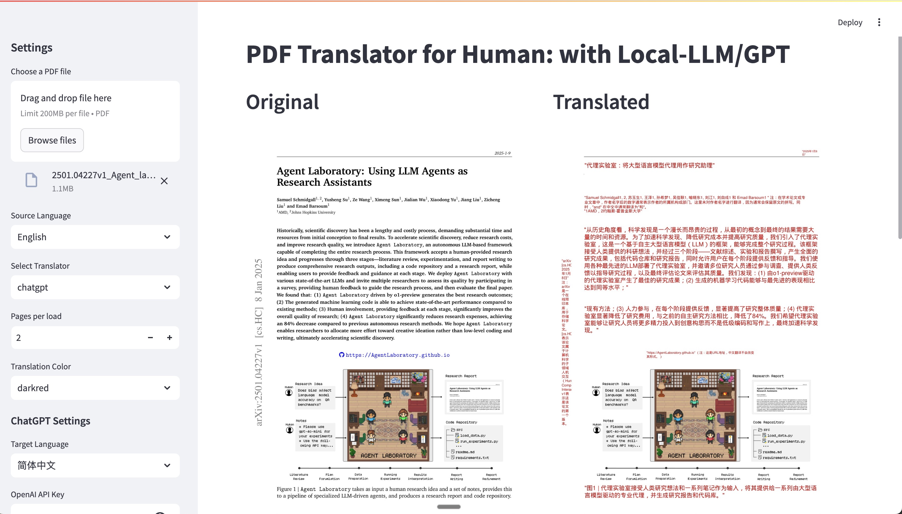

# PDF Translator for Human: A PDF Reader/Translator with Local LLM/ChatGPT or Google

## Use Case

There is tons of PDF reader/translator with AI supported. However none of them meets my need. I hope it could run totally on local with local LLMs.

I hope to read both the original PDF and the translated pages side by side. 
Also I don't like to translate a 1000 pages long PDF file all at once, it costs lots of time and tokens. And most of the time, I never complete reading through all contents of a long paper.

## Features in PDF Translator for Human
You can read both the original PDF file and the translated content side by side.

The local/remote translation API is invoked on a per-page basis as needed, triggered by page turns during reading.

## Snapshot



## Huggingface Space

https://huggingface.co/spaces/davideuler/pdf-translator-for-human

## Supported translators and LLMs:
* Google Translator (NO need api-key, it it totally free)
* Local deployed LLMs (ollama, llama.cpp, mlx_lm ... etc.)
* ChatGPT
* DeepSeek (Use the OpenAI Compatible endpoint at https://api.deepseek.com/v1)
* Qwen (Use the OpenAI Compatible endpoint)

* Other OpenAI Compatible LLMs like GLM/Moonshot etc.

## Start the Web Application for PDF Translator for Human


``` bash
./run_translator_web.sh

# or just start the streamlit application if you have run the previous script:
streamlit run app.py

```

## Notes on deployment and starting a local llm inference service

### Option 1.Start local llm By mlx_lm (works on Mac Sillicon.)

Here I download aya-expanse-8b 4bit as an example.

``` Bash
# download mlx models from huggingface to local folder
git clone https://huggingface.co/mlx-community/aya-expanse-8b-4bit

# install mlx_lm
pip install mlx_lm

# start the server
mlx_lm.server --model ./aya-expanse-8b-4bit --port 8080

```

### Option 2. By llama.cpp (Works on CPU/GPU/Mac Machines)

Llama.cpp works on CPU machines and Mac Intel/Sillicon machines, you need 48GB memories for aya-expanse-32b-q4_k_m.gguf.

``` Bash
# download gguf models from huggingface to local folder
wget https://hf-mirror.co/bartowski/aya-expanse-32b-GGUF/resolve/main/aya-expanse-32b-Q4_K_M.gguf -O aya-expanse-32b-Q4_K_M.gguf

# download llama.cpp and install llama.cpp
git clone https://github.com/ggerganov/llama.cpp
cd llama.cpp
mkdir -p build && cmake -B build
cmake --build build --config Release -j 12

# start llama.cpp server
./llama-server -m ~/models/aya-expanse-32b-Q4_K_M.gguf --port 8080

```

### Options 3. Local inference service by ollama/vLLM and other application such as LMStudio

Please read the official guide for you LLM inferencing tool.

### Option 4. Note on using OpenAI Compatible LLM service provider

For example, run the following command before start the streamlit application to enable translation by deepseek :

``` bash
export OPENAI_MODEL=deepseek-chat
export OPENAI_API_BASE=https://api.deepseek.com/v1
export OPENAI_API_KEY=sk-xxxx
```

Run the following command before start the streamlit application to enable translation by moonshot :

``` bash
export OPENAI_MODEL=moonshot-v1-8k
export OPENAI_API_BASE=https://api.moonshot.cn/v1
export OPENAI_API_KEY=sk-xxxx
```


## Acknowlegement

https://github.com/nidhaloff/deep-translator

The project is based on the awesome deep-translator. Thanks to the excellent work in the original project, I can integrate it to the pdf translator tool.

Pull Requests are welcome.